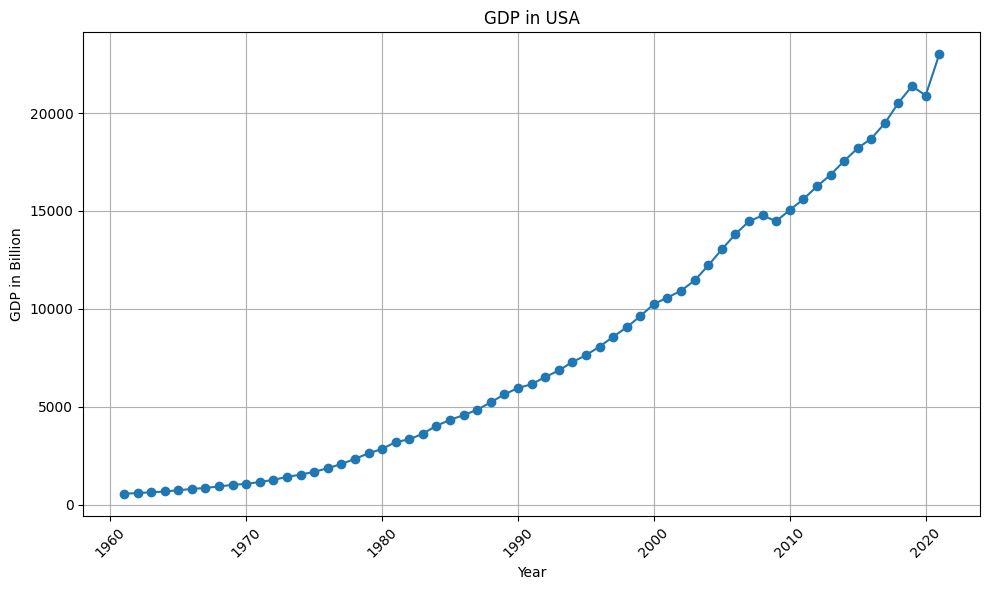
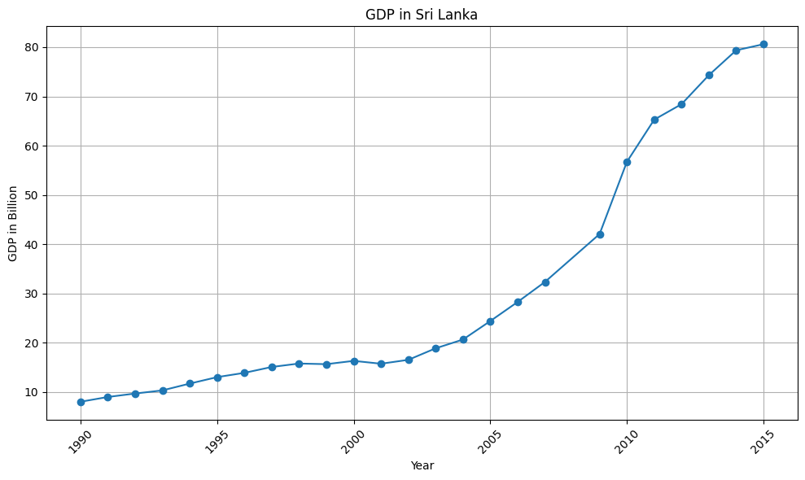

# GDP-and-Economic-Comparison-Sri-Lanka-vs.-USA

# Data Preparation
Dataset imported from kaggle 
To do analysis we require both data related to Sri Lanka and USA. But its difficult to find all data from same data set. So data imported from two datasets seperately. 
https://www.kaggle.com/datasets/amritharj/economy-of-sri-lanka
https://www.kaggle.com/datasets/malayvyas/usa-gdp-dataset-19612021

# Data Process 
- Using python we have identified null values and removed from both datasets. 
- There is no any duplication therefore no need to remove duplications 
- Except year all data types are inappropriate so they have cleaned with removing unwanted strings 
- Converted to appropriate data types 
- Given suitable names which haven't proper names before 

## GDP Analysis in USA

- **Visual Analysis**: The GDP values are plotted over time, revealing fluctuations and trends.

- **Turning Points**: Using Python code, turning points in the GDP trend are identified. These turning points indicate significant shifts in the GDP trajectory.

## Overview
This project analyzes the Gross Domestic Product (GDP) values of the USA over time to identify trends and significant turning points.

### Methodology
- Data: The analysis utilizes historical GDP data obtained from reliable sources.
- Tools: Python programming language and data analysis libraries (e.g., Pandas, Matplotlib) are used for data manipulation and visualization.

### Findings

### GDP Trend Analysis
- **Visual Analysis**: The GDP values are plotted over time, revealing fluctuations and trends.
- **Turning Points**: Using Python code, turning points in the GDP trend are identified. These turning points indicate significant shifts in the GDP trajectory.

### Interpretation
- **Pre-2008 Growth**: Until 2008, the GDP showed continuous growth, indicating a stable economy.
- **Impact of 2008**: In 2008, a local maximum is observed, suggesting a peak in economic activity. However, this is followed by a local minimum in 2009, indicating a downturn likely caused by external factors such as the global financial crisis.
- **Post-2009 Recovery**: After 2009, the economy stabilizes, albeit at a lower level. The GDP gradually increases until 2019.
- **2020 Decline**: In 2020, a significant decrease in GDP is observed, possibly due to unprecedented events such as the COVID-19 pandemic. The GDP drops to 20893.74 billion, marking a substantial downturn.
- **Post-2020 Recovery**: Despite the 2020 decline, the GDP exhibits a remarkable recovery post-2020, showing signs of rapid growth.

### Future Implications
- **Predictive Analysis**: Based on the observed trends, it is predicted that the GDP will continue to increase rapidly in the future if no significant adverse events occur.

### Conclusion
The analysis provides insights into the historical trends and turning points in the USA's GDP. Understanding these patterns is crucial for making informed decisions in economics and policy-making.

## GDP Analysis in Sri Lanka

- **Visual Analysis**: The GDP values are plotted over time, revealing fluctuations and trends.

- **Turning Points**: Using Python code, turning points in the GDP trend are identified. These turning points indicate significant shifts in the GDP trajectory.

### Overview
This project analyzes the Gross Domestic Product (GDP) values of Sri Lanka over time to identify trends and significant turning points.

### Methodology
- Data: The analysis utilizes historical GDP data obtained from reliable sources.
- Tools: Python programming language and data analysis libraries (e.g., Pandas, Matplotlib) are used for data manipulation and visualization.

### Findings

#### GDP Trend Analysis
- **Visual Analysis**: The GDP values are plotted over time, revealing fluctuations and trends.
- **Turning Points**: Using Python code, turning points in the GDP trend are identified. These turning points indicate significant shifts in the GDP trajectory.

#### Interpretation
- **Consistent Growth (1990-2000)**: From 1990 until approximately 2000, the GDP of Sri Lanka exhibits consistent growth at a steady pace.
- **Reduction in 2001**: A notable decrease in GDP is observed in 2001, where it declines from 16.33 billion to 15.71 billion. This suggests that something may have adversely affected the economy during this period.
- **Stagnation (1997-2002)**: Between 1997 and 2002, the GDP growth appears to stagnate, with little to no significant increase observed.
- **Rapid Growth (2004-2010)**: Following around 2004, the GDP starts to grow rapidly, indicating a significant increase in economic activity.
- **Slowdown Post-2011**: However, after 2011, the pace of growth begins to slow down until the end of the dataset in 2015, suggesting a potential decline in economic activity.

#### Future Implications
- **Predictive Analysis**: Based on the observed trends, it is predicted that the GDP growth in Sri Lanka may experience fluctuations influenced by various economic factors.

### Conclusion
The analysis provides insights into the historical trends and turning points in Sri Lanka's GDP. Understanding these patterns is crucial for making informed decisions in economics and policy-making.
