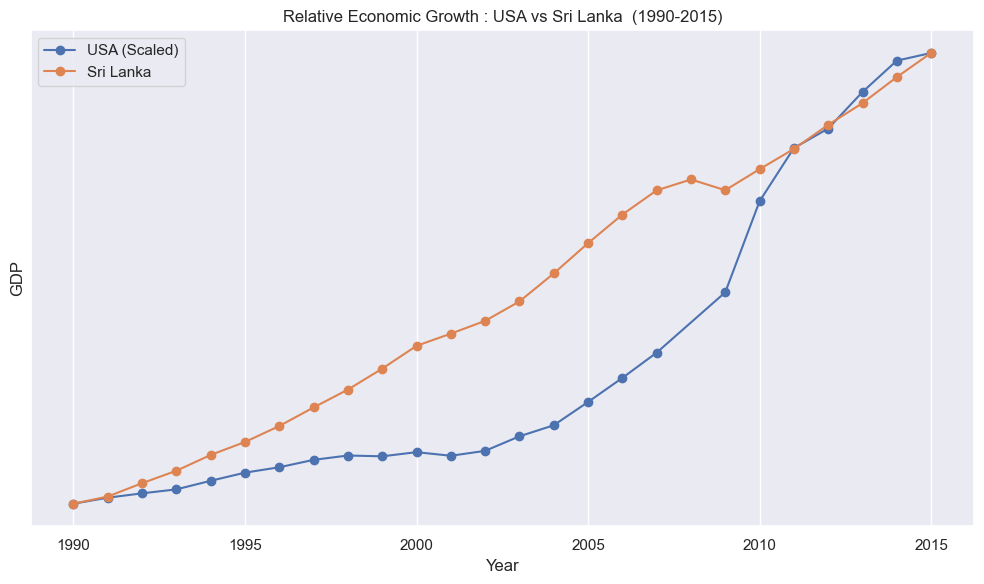
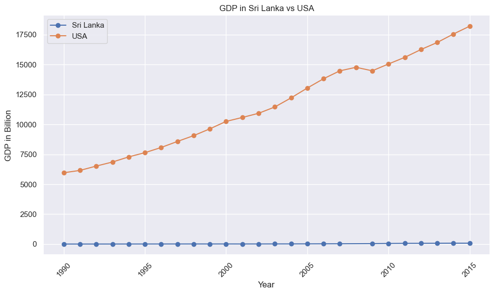
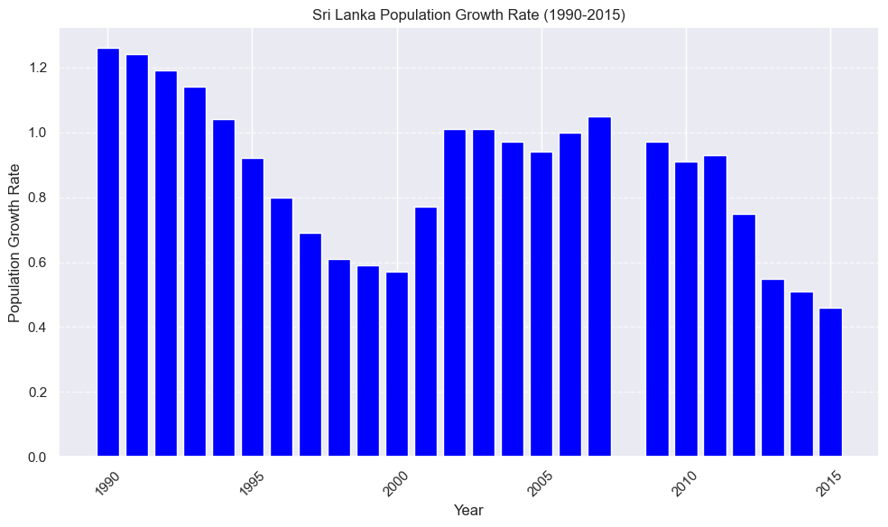
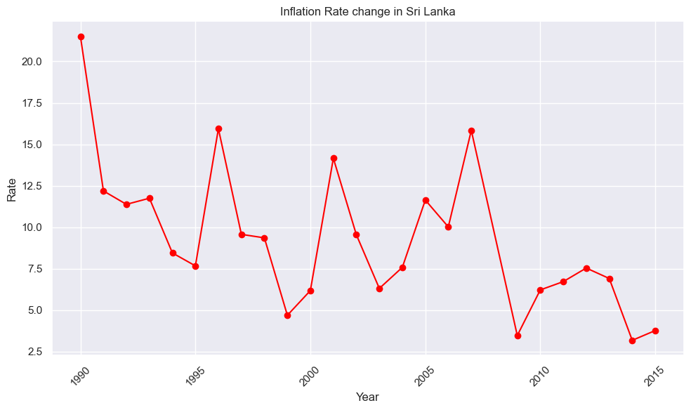
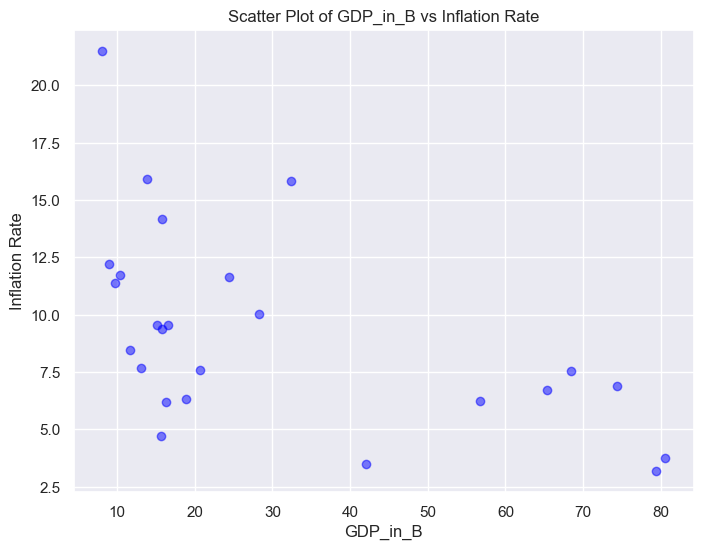

# GDP-and-Economic-Comparison-Sri-Lanka-vs.-USA

# Data Preparation
Dataset imported from kaggle 
To do analysis we require both data related to Sri Lanka and USA. But its difficult to find all data from same data set. So data imported from two datasets seperately. 
https://www.kaggle.com/datasets/amritharj/economy-of-sri-lanka
https://www.kaggle.com/datasets/malayvyas/usa-gdp-dataset-19612021

# Data Process 
- Using python we have identified null values and removed from both datasets. 
- There is no any duplication therefore no need to remove duplications 
- Except year all data types are inappropriate so they have cleaned with removing unwanted strings 
- Converted to appropriate data types 
- Given suitable names which haven't proper names before 

## GDP Analysis in USA

- **Visual Analysis**: The GDP values are plotted over time, revealing fluctuations and trends.

- **Turning Points**: Using Python code, turning points in the GDP trend are identified. These turning points indicate significant shifts in the GDP trajectory.

## Overview
This project analyzes the Gross Domestic Product (GDP) values of the USA over time to identify trends and significant turning points.

### Methodology
- Data: The analysis utilizes historical GDP data obtained from reliable sources.
- Tools: Python programming language and data analysis libraries (e.g., Pandas, Matplotlib) are used for data manipulation and visualization.

### Findings

### GDP Trend Analysis
- **Visual Analysis**: The GDP values are plotted over time, revealing fluctuations and trends.
- **Turning Points**: Using Python code, turning points in the GDP trend are identified. These turning points indicate significant shifts in the GDP trajectory.

### Interpretation
- **Pre-2008 Growth**: Until 2008, the GDP showed continuous growth, indicating a stable economy.
- **Impact of 2008**: In 2008, a local maximum is observed, suggesting a peak in economic activity. However, this is followed by a local minimum in 2009, indicating a downturn likely caused by external factors such as the global financial crisis.
- **Post-2009 Recovery**: After 2009, the economy stabilizes, albeit at a lower level. The GDP gradually increases until 2019.
- **2020 Decline**: In 2020, a significant decrease in GDP is observed, possibly due to unprecedented events such as the COVID-19 pandemic. The GDP drops to 20893.74 billion, marking a substantial downturn.
- **Post-2020 Recovery**: Despite the 2020 decline, the GDP exhibits a remarkable recovery post-2020, showing signs of rapid growth.

### Future Implications
- **Predictive Analysis**: Based on the observed trends, it is predicted that the GDP will continue to increase rapidly in the future if no significant adverse events occur.

### Conclusion
The analysis provides insights into the historical trends and turning points in the USA's GDP. Understanding these patterns is crucial for making informed decisions in economics and policy-making.

## GDP Analysis in Sri Lanka

- **Visual Analysis**: The GDP values are plotted over time, revealing fluctuations and trends.

- **Turning Points**: Using Python code, turning points in the GDP trend are identified. These turning points indicate significant shifts in the GDP trajectory.

### Overview
This project analyzes the Gross Domestic Product (GDP) values of Sri Lanka over time to identify trends and significant turning points.

### Methodology
- Data: The analysis utilizes historical GDP data obtained from reliable sources.
- Tools: Python programming language and data analysis libraries (e.g., Pandas, Matplotlib) are used for data manipulation and visualization.

### Findings

#### GDP Trend Analysis
- **Visual Analysis**: The GDP values are plotted over time, revealing fluctuations and trends.
- **Turning Points**: Using Python code, turning points in the GDP trend are identified. These turning points indicate significant shifts in the GDP trajectory.

#### Interpretation
- **Consistent Growth (1990-2000)**: From 1990 until approximately 2000, the GDP of Sri Lanka exhibits consistent growth at a steady pace.
- **Reduction in 2001**: A notable decrease in GDP is observed in 2001, where it declines from 16.33 billion to 15.71 billion. This suggests that something may have adversely affected the economy during this period.
- **Stagnation (1997-2002)**: Between 1997 and 2002, the GDP growth appears to stagnate, with little to no significant increase observed.
- **Rapid Growth (2004-2010)**: Following around 2004, the GDP starts to grow rapidly, indicating a significant increase in economic activity.
- **Slowdown Post-2011**: However, after 2011, the pace of growth begins to slow down until the end of the dataset in 2015, suggesting a potential decline in economic activity.

#### Future Implications
- **Predictive Analysis**: Based on the observed trends, it is predicted that the GDP growth in Sri Lanka may experience fluctuations influenced by various economic factors.

### Conclusion
The analysis provides insights into the historical trends and turning points in Sri Lanka's GDP. Understanding these patterns is crucial for making informed decisions in economics and policy-making.

## GDP Analysis Comparison between USA and Sri Lanka

### Overview
This analysis compares the Gross Domestic Product (GDP) trends between the USA and Sri Lanka from 1990 to 2015. The purpose is to understand the relative growth rates and patterns of both countries' economies during this period.

### Insights

#### Relative Growth Comparison
- Between 1990 and 2000, Sri Lanka shows a higher relative growth rate compared to the USA.
- After 2000, both countries exhibit similar relative growth trends, with their GDP values moving in parallel.
- Around 2009, there is a notable divergence in growth patterns: Sri Lanka's growth slows down while the USA's growth accelerates.
- Despite differences in growth rates, both countries experience GDP growth over the years, albeit at varying speeds.

#### Impact of Absolute GDP Values
- The absolute GDP values of the USA are significantly larger than those of Sri Lanka, making it challenging to discern the relative growth patterns without scaling.
- Due to the large GDP values of the USA, its chart may appear less significant when plotted alongside Sri Lanka's chart.

### Visualization
To visually compare the GDP trends between the USA and Sri Lanka, a chart has been generated showing the relative growth rates over time. The USA GDP values have been scaled to allow for a more meaningful comparison with Sri Lanka's GDP trend.

### Conclusion
Analyzing the GDP trends of both countries provides valuable insights into their economic trajectories. Despite differences in absolute GDP values, understanding the relative growth rates and patterns can offer valuable insights for stakeholders and policymakers.

## Sri Lanka Population Growth Rate Analysis

### Overview
This analysis examines the population growth rate in Sri Lanka from 1990 to 2015. The goal is to understand the trends and fluctuations in population growth during this period.

### Insights

### Population Growth Trends
- The population growth rate in Sri Lanka experienced fluctuations throughout the analyzed period.
- In 1990, the growth rate was relatively high, but it decreased until around 2000.
- After 2000, there was an increase in the growth rate, followed by another decline after 2012 until 2015.
- The growth rate seems to have been higher in the past, but it has been relatively controlled in recent years.

### Visualization
To visualize the population growth rate trends in Sri Lanka, a bar chart has been generated showing the growth rates for each year from 1990 to 2015.

### Conclusion
Analyzing the population growth rate trends provides insights into the demographic changes in Sri Lanka over time. Understanding these trends is essential for demographic planning and policymaking.

## Sri Lanka Inflation Rate Analysis

### Overview
This analysis examines the inflation rate in Sri Lanka from 1990 to 2015. The goal is to understand the trends and fluctuations in inflation during this period.

### Insights

### Inflation Rate Trends
- From 1990 to 1992, the inflation rate experienced a decline, indicating a period of decreasing prices or lower price increases.
- After 1992, the inflation rate exhibited fluctuations, with significant variations observed from year to year.
- There are fluctuations in the inflation rate over the years, indicating changes in economic conditions or government policies.
- In 2015, there was an increase in the inflation rate, suggesting a period of rising prices or higher price increases.
- Further analysis beyond 2015 is not possible due to the lack of available data.

### Visualization
To visualize the inflation rate trends in Sri Lanka, a line chart or bar chart can be generated showing the inflation rates for each year from 1990 to 2015.

### Conclusion
Analyzing the inflation rate trends provides insights into the economic conditions and price stability in Sri Lanka over time. Understanding these trends is crucial for policymakers and economists in managing inflation and maintaining economic stability.

## Insights: Relationship between GDP and Inflation Rate

When analyzing the relationship between GDP and inflation rate, several patterns emerge:

- **Inverse Relationship**: Generally, when GDP has a low value, the inflation rate tends to be higher, and vice versa. This inverse relationship suggests that changes in GDP can influence inflationary pressures within an economy.

- **High GDP and Low Inflation**: Conversely, when GDP reaches higher levels, the inflation rate often decreases. This phenomenon may occur due to increased economic productivity, leading to stable prices and reduced inflationary pressures.

- **High Inflation and Low GDP**: Instances of high inflation rates are often observed when GDP levels are low. This situation can indicate economic instability, supply shortages, or excessive money supply, leading to increased prices.

- **Low Inflation at Moderate GDP Levels**: Interestingly, there are cases where GDP levels are moderate, but the inflation rate remains relatively low. This scenario suggests a stable economic environment with controlled inflation despite average GDP values.

- **Clusters of Data Points**: Within certain ranges of GDP and inflation rate values, clusters of data points are observed. For instance, between GDP amounts of 10 billion and 20 billion and inflation rates ranging from approximately 7.5% to 12.5%, numerous data points form distinct groups. These clusters may represent specific economic conditions or policy interventions affecting GDP and inflation dynamics.

